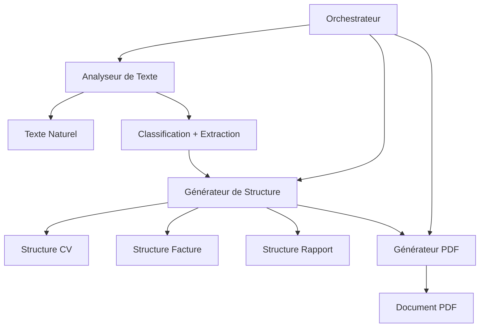

# Présentation - Générateur de Contenu Structuré

## Introduction
**Projet de Fin de Cours - IA Générative 2025**

### Objectif
Développer un workflow multi-agents qui transforme des informations en langage naturel en documents structurés au format PDF.

### Technologies clés
- Semantic Kernel
- ReportLab
- Python
- OpenAI API
- LangChain

---

## Architecture Multi-Agents



---

## Agents du Système

### 1. Agent Analyseur de Texte
- **Rôle**: Analyse sémantique du texte d'entrée
- **Technologies**: Semantic Kernel + OpenAI
- **Fonctionnalités**:
  - Classification du type de document
  - Extraction des données pertinentes
  - Évaluation de la confiance

### 2. Agent Générateur de Structure
- **Rôle**: Transformation des données extraites
- **Fonctionnalités**:
  - Création de structures de données typées
  - Normalisation des informations
  - Validation des données

---

## Agents du Système (suite)

### 3. Agent Générateur PDF
- **Rôle**: Création du document final
- **Technologies**: ReportLab
- **Fonctionnalités**:
  - Mise en page professionnelle
  - Support des formats CV, facture, rapport
  - Génération de tableaux et styles

### 4. Agent Orchestrateur
- **Rôle**: Coordination du workflow
- **Fonctionnalités**:
  - Séquencement des étapes
  - Gestion des erreurs
  - Interface utilisateur

---

## Workflow de Génération

1. **Entrée Utilisateur**
   - Texte en langage naturel
   - Ex: "CV de Jean Dupont, développeur Python..."

2. **Analyse Sémantique**
   - Classification du document
   - Extraction des données structurées

3. **Génération de Structure**
   - Transformation en objet structuré
   - Validation des informations

4. **Création du PDF**
   - Mise en page selon le type
   - Génération du document final

---

## Exemples de Sortie

### CV
- Informations personnelles
- Expériences professionnelles
- Formations
- Compétences

### Facture
- Numéro et date
- Informations client
- Détails des services
- Calculs TVA et total

### Rapport
- Titre et auteur
- Résumé
- Sections structurées
- Conclusions

---

## Démo en Direct

### Étapes de la démonstration
1. Préparation de l'environnement
2. Configuration de l'API OpenAI
3. Exécution avec différents types de texte
4. Visualisation des documents générés

### Commandes clés
```bash
# Installation
pip install -r requirements.txt

# Configuration
cp .env.example .env

# Exécution
python test_examples.py
```

---

## Défis Techniques

### 1. Compatibilité Python 3.13
- Problème: Semantic Kernel et dépendances
- Solution: Utilisation de versions compatibles

### 2. Extraction Précise
- Problème: Variabilité du langage naturel
- Solution: Prompts optimisés + validation

### 3. Mise en Page PDF
- Problème: Formatage complexe
- Solution: Styles ReportLab personnalisés

---

## Améliorations Futures

### Fonctionnalités
- Interface web (Streamlit/Gradio)
- Support de formats supplémentaires
- Personnalisation des templates

### Performance
- Cache des résultats
- Optimisation des prompts
- Traitement par lots

### Sécurité
- Validation des entrées
- Gestion des erreurs robuste
- Journalisation

---

## Conclusion

### Résumé
- Système multi-agents fonctionnel
- Workflow complet de A à Z
- Documents PDF de qualité professionnelle

### Apports du Projet
- Application concrète de l'IA générative
- Architecture modulaire et extensible
- Solution pratique pour la productivité

### Merci pour votre attention!
**Questions?**